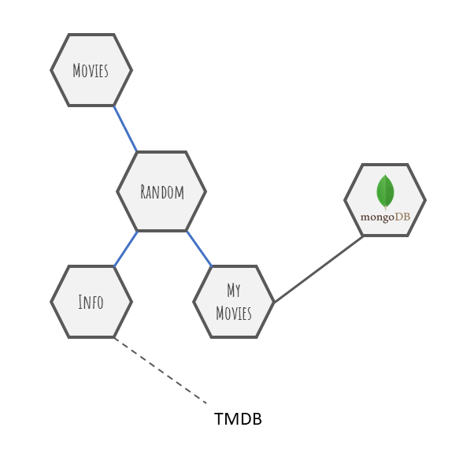

# Proyecto TADW


### Ejecutar el proyecto:

```
git clone https://github.com/matichewer/proyecto-TADW
cd proyecto-TADW
docker-compose up
```

#### Comandos útiles para resetear la base de datos:
```
docker-compose down
docker volume rm tadw-dc_mongodb-data
```

------------

## Enunciado del proyecto:

El objetivo de esta tarea es definir una colección de microservicios simples dockerizados que pueden ejecutarse utilizando docker-compose. 



Se definen los siguientes microservicios:

- **Movies:** Es el microservicio principal, que muestra una pagina web con la información recolectada.
- **MyMovies:** mantiene una lista de mis peliculas favoritas. Puede almacenarse el nombre solamente, o algún identificador apropiado.
- **Random:** provee informacion de cinco películas al azar de MyMovies, con información sobre cada película que obtiene del microservicio Info
- **Info:** utiliza TMDB para obtener información de películas  
- **MongoDB:** Los datos están almacenados como colecciones en MongoDB, también dockerizado.

La página puede ser simple, nada muy elaborado porque el énfasis está en los microservicios.
Pueden utilizar cualquier lenguaje en los microservicios, pues estarán dockerizados finalmente.
Dado que no tiene un CRUD para los datos, podemos hacer que el Mongo dockerizado tenga ya unos datos cargados y trabajar con ellos. NO necesitan ser todo lo que tiene TMDB, basta con el nombre de la pelicula y eventualmente algun otro dato que la identifique. El resto de la información se obtiene del microservicio Info.

La entrega consiste en el repositorio que podemos bajar y ejecutar todo con docker-compose.


